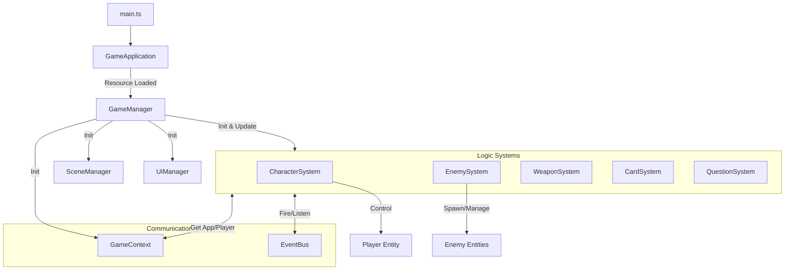

toolName: view_folder
            
status: success
          
e:\Ugh-Study\src
          

        
            
toolName: todo_write
            
status: success
          
Todos updated: 4 items
          

        
            
toolName: view_files
            
status: success
          
            
filePath: e:\Ugh-Study\src\core\EventBus.ts
          

        
            
toolName: view_files
            
status: success
          
            
filePath: e:\Ugh-Study\src\core\GameApplication.ts
          

        
            
toolName: view_files
            
status: success
          
            
filePath: e:\Ugh-Study\src\main.ts
          

        
            
toolName: view_files
            
status: success
          
            
filePath: e:\Ugh-Study\src\core\GameManager.ts
          

        
            
toolName: view_files
            
status: success
          
            
filePath: e:\Ugh-Study\src\core\GameContext.ts
          

        
            
toolName: view_files
            
status: success
          
            
filePath: e:\Ugh-Study\src\systems\enemy\EnemySystem.ts
          

        
            
toolName: view_files
            
status: success
          
            
filePath: e:\Ugh-Study\src\systems\card\CardSystem.ts
          

        
            
toolName: todo_write
            
status: success
          
Todos updated: 4 items
          
基于对代码库的分析，该项目采用了 **Modular Architecture (模块化架构)**，核心围绕 **Manager（管理器）** + **System（系统）** + **EventBus（事件总线）** 构建。

以下是详细的逻辑结构整理：

### 1. 通信链路 (Communication Link)

项目的通信核心是 **解耦**，主要通过以下两种方式：

*   **全局事件总线 ([EventBus.ts](src/core/EventBus.ts))**:
    *   **机制**: 封装了 PlayCanvas 的 `pc.EventHandler`，是一个全局单例。
    *   **作用**: 处理跨系统、UI与逻辑、实体与系统之间的通信。
    *   **典型案例**:
        *   `EnemySystem` 监听 `enemy:death` 来生成经验球。
        *   `CardSystem` 监听 `player:levelUp` 来暂停游戏并显示卡牌选择 UI。
        *   `WeaponSystem` (推测) 触发 `combat:hit`，`EnemySystem` 监听到后扣除敌人血量。
*   **服务定位器 ([GameContext.ts](src/core/GameContext.ts))**:
    *   **机制**: 全局单例，持有核心对象的引用。
    *   **作用**: 提供全局访问点，避免层层传递参数。
    *   **持有对象**: `Application` (PlayCanvas 实例), `Player` (玩家实体), `Camera`, `GameManager`, `UIManager`。

### 2. 系统运行流程 (System Operation)

启动流程清晰且线性：

1.  **入口 ([main.ts](src/main.ts))**:
    *   实例化 `GameApplication`。
    *   调用 `gameApp.start()`。
2.  **应用启动 ([GameApplication.ts](src/core/GameApplication.ts))**:
    *   初始化 PlayCanvas `pc.Application`。
    *   `ResourceManager` 预加载资源。
    *   启动 PlayCanvas 主循环。
3.  **游戏逻辑初始化 ([GameManager.ts](src/core/GameManager.ts))**:
    *   资源加载完成后，`main.ts` 调用 `GameManager.getInstance()`。
    *   `GameManager` 构造函数执行核心初始化序列：
        1.  **注册脚本**: 注册 Player, Enemy, Weapon 等 PlayCanvas 脚本组件。
        2.  **构建场景**: `SceneManager` 创建相机、灯光、地面。
        3.  **UI 初始化**: `UIManager` 准备 HUD 和弹窗。
        4.  **创建玩家**: 生成玩家实体并挂载控制脚本。
        5.  **初始化系统**: 按顺序初始化 `DebugSystem`, `CharacterSystem`, `EnemySystem` 等。
        6.  **启动循环**: 监听 PlayCanvas 的 `update` 事件，驱动所有 System 的 `update`。

### 3. 管理器工作方式 (Manager Workflow)

**[GameManager.ts](src/core/GameManager.ts)** 是整个游戏的指挥官（Conductor）：

*   **职责**:
    *   **生命周期管理**: 负责创建和销毁所有子系统。
    *   **主循环驱动**: 每一帧调用所有 `System.update(dt)`。
    *   **状态协调**: 虽然逻辑分散在各系统，但 GameManager 掌握全局的初始化顺序。

**其他核心管理器**:
*   **[UIManager.ts](src/core/UIManager.ts)**: 管理 HUD、飘字、技能选择弹窗等。
*   **[SceneManager.ts](src/core/SceneManager.ts)**: 负责静态场景元素的构建（非动态实体）。

### 4. 逻辑结构图解

### 总结
*   **架构风格**: 混合了 **ECS (Entity-Component-System)** 的思想（System 管理逻辑，Entity 承载数据/表现）和 **OOP**（Manager 单例模式）。
*   **优点**: 模块清晰，System 之间低耦合（通过 EventBus），全局状态访问方便（通过 GameContext）。
*   **扩展性**: 新增玩法只需新建一个 System 并注册到 `GameManager` 即可。