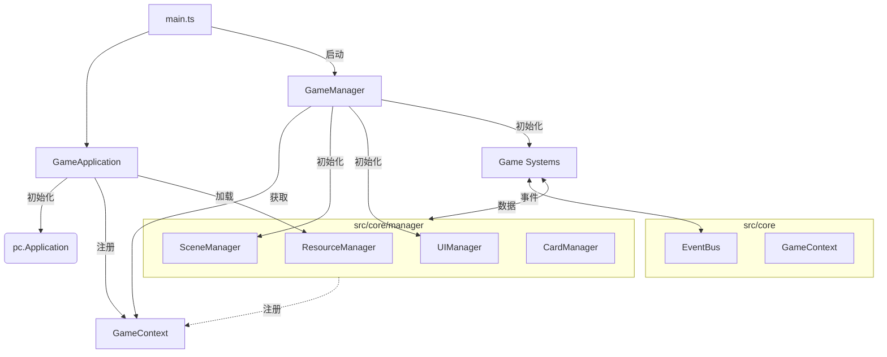

# 核心架构

## 高层拓扑结构

## 通信流程

1.  **初始化 (Initialization)**:
    *   `GameApplication` 初始化引擎和 `ResourceManager`。
    *   `GameManager` 初始化 `SceneManager`、`UIManager` 和所有游戏系统 (Game Systems)。
    *   所有管理器把自己注册到 `GameContext` 中。

2.  **运行时 (Runtime)**:
    *   系统通过 `GameContext.getInstance().getManagerName()` 获取管理器。
    *   系统之间通过 `EventBus` 进行通信。

## 管理器角色

| 管理器 | 职责 |
| :--- | :--- |
| **ResourceManager** | 通过 Vite glob 导入处理资源加载（图像、音频、模型）。 |
| **SceneManager** | 构建静态 3D 环境（灯光、摄像机、地面）。 |
| **UIManager** | 管理 2D UI 层、HUD 和弹出窗口。 |
| **CardManager** | 管理牌组状态、卡牌定义和手牌逻辑。 |
