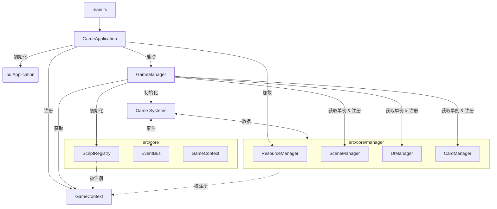
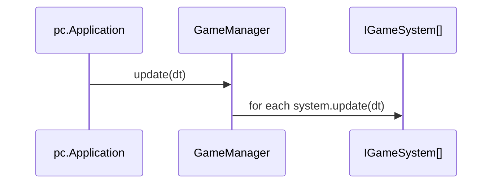
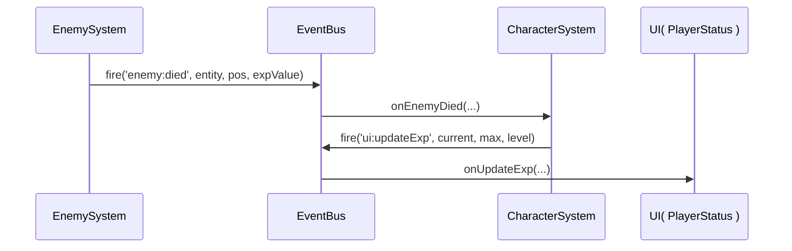
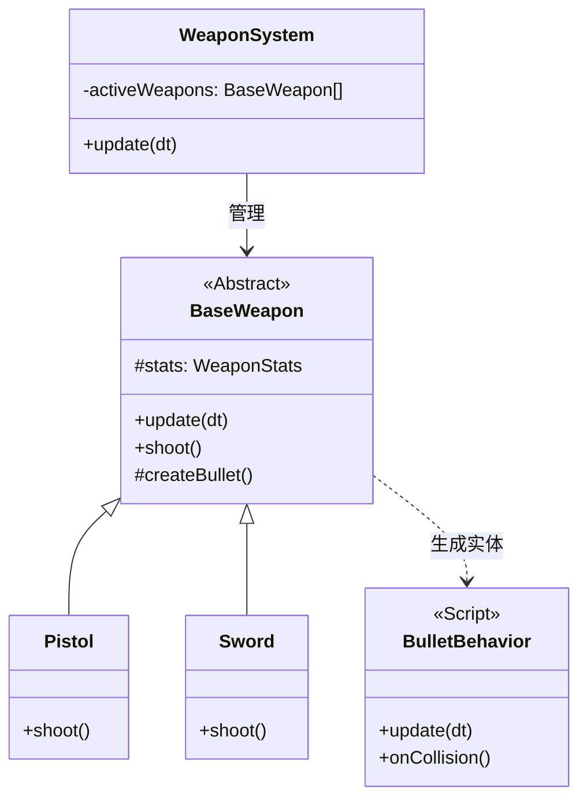

# 核心架构

本文件描述“代码实际如何跑起来”：启动顺序、每帧调用链、模块边界，以及系统间如何通过事件通信。

## 高层拓扑结构

## 通信流程

1.  **初始化 (Initialization)**:

    - `GameApplication` 初始化引擎，注册 `App` 到上下文，并加载资源。
    - 资源加载完成后，`GameApplication` 启动 `GameManager`。
    - `GameManager` 获取各管理器单例 (`SceneManager`, `UIManager` 等) 并注册到 `GameContext`。
    - `GameManager` 通过 `GameContext.getScriptRegistry().init()` 统一注册所有脚本。
    - `GameManager` 初始化所有游戏系统 (Game Systems)。

2.  **运行时 (Runtime)**:
    - 系统通过 `GameContext.getInstance().getManagerName()` 获取管理器。
    - 系统之间通过 `EventBus` 进行通信。

## 启动顺序（精确到类/文件）

1. `src/main.ts`：创建 `GameApplication` 并调用 `start()`
2. `src/core/GameApplication.ts`
   - 构造函数：创建 `pc.Application`，并写入 `GameContext.setApp(app)`
   - `start()`：`ResourceManager.loadAll()` → `GameManager.getInstance()` → `app.start()`
3. `src/core/GameManager.ts`（构造函数）
   - `GameContext.setGameManager(this)`
   - `GameContext.getScriptRegistry().init()`（统一 `pc.registerScript`）
   - `SceneManager.buildScene()`（创建地面/灯光/相机，并写入 `GameContext.setCamera(...)`）
   - `UIManager.getInstance()`（初始化所有 UI，UI 会在构造时订阅事件）
   - `CardManager.getInstance()`（加载静态卡牌表）
   - `createPlayer()`（创建玩家实体并写入 `GameContext.setPlayer(...)`）
   - `initializeSystems()`（创建并初始化系统列表）
   - `app.on('update', this.update, this)`（进入每帧驱动）

## 每帧更新调用链

核心点：

- `GameManager.update(dt)` 只负责“编排”，不直接写业务逻辑
- 业务逻辑尽量写在系统里（实现 `IGameSystem`），并在 `initializeSystems()` 中注册

## 管理器角色

| 管理器              | 职责                                                  |
| :------------------ | :---------------------------------------------------- |
| **ResourceManager** | 通过 Vite glob 导入处理资源加载（图像、音频、模型）。 |
| **SceneManager**    | 构建静态 3D 环境（灯光、摄像机、地面）。              |
| **UIManager**       | 管理 2D UI 层、HUD 和弹出窗口。                       |
| **CardManager**     | 提供只读卡牌数据（从 `config/cards.ts` 读取）。       |
| **ScriptRegistry**  | 管理 PlayCanvas 脚本的自动收集与统一注册。            |

## 系统/事件通信示例（以“敌人死亡 → 玩家获得经验 → UI 更新”为例）

说明：

- `EnemySystem` 负责“何时判定敌人死了、何时销毁实体”
- `CharacterSystem` 负责“经验、等级、玩家属性与 HUD 刷新”
- UI 不主动查询系统状态，只订阅 `ui:*` 事件并渲染

## 子系统架构

### 武器系统 (Weapon System)

武器系统采用了 **逻辑与表现分离 (Logic vs Entity)** 的设计模式，以支持高性能和易扩展性。

- **WeaponSystem**: 纯逻辑管理器，负责每帧更新所有活跃武器的状态（如冷却时间）。
- **BaseWeapon**: 武器逻辑基类，处理通用的冷却、属性（WeaponStats）逻辑。不绑定到具体的 PlayCanvas Entity，而是按需创建。
- **Entity/Script**: 实际的游戏对象（如子弹、特效）由 `BaseWeapon` 创建，并挂载轻量级的行为脚本（如 `BulletBehavior`）处理物理运动和碰撞。

## 实践约定（避免踩坑）

- **不要在构造函数里 `getApp()` 做重逻辑**：保证类可以被创建，但把“依赖已就绪”的逻辑放到 `initialize()`
- **系统里缓存 Context 引用**：构造函数里拿到 `eventBus/app/ui`，每帧不要重复 `getInstance()` 做大量查找
- **事件订阅要成对解除**：UI/系统如果支持销毁，记得 `off(...)`（例如 UI 模块有 `destroy()`）
- **避免系统互相 new 系统**：系统的组装通常由 `GameManager.initializeSystems()` 统一完成（调试系统例外）
