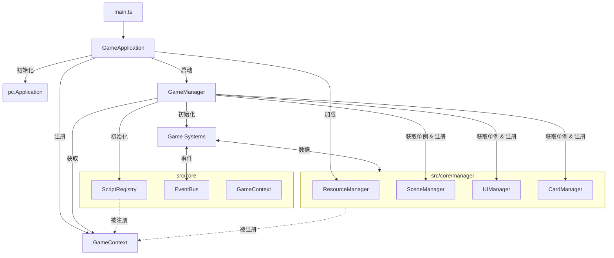
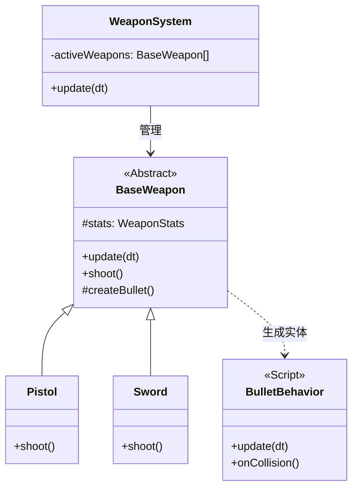

# 核心架构

## 高层拓扑结构

## 通信流程

1.  **初始化 (Initialization)**:

    - `GameApplication` 初始化引擎，注册 `App` 到上下文，并加载资源。
    - 资源加载完成后，`GameApplication` 启动 `GameManager`。
    - `GameManager` 获取各管理器单例 (`SceneManager`, `UIManager` 等) 并注册到 `GameContext`。
    - `GameManager` 通过 `GameContext.getScriptRegistry().init()` 统一注册所有脚本。
    - `GameManager` 初始化所有游戏系统 (Game Systems)。

2.  **运行时 (Runtime)**:
    - 系统通过 `GameContext.getInstance().getManagerName()` 获取管理器。
    - 系统之间通过 `EventBus` 进行通信。

## 管理器角色

| 管理器              | 职责                                                  |
| :------------------ | :---------------------------------------------------- |
| **ResourceManager** | 通过 Vite glob 导入处理资源加载（图像、音频、模型）。 |
| **SceneManager**    | 构建静态 3D 环境（灯光、摄像机、地面）。              |
| **UIManager**       | 管理 2D UI 层、HUD 和弹出窗口。                       |
| **CardManager**     | 管理牌组状态、卡牌定义和手牌逻辑。                    |
| **ScriptRegistry**  | 管理 PlayCanvas 脚本的自动收集与统一注册。            |

## 子系统架构

### 武器系统 (Weapon System)

武器系统采用了 **逻辑与表现分离 (Logic vs Entity)** 的设计模式，以支持高性能和易扩展性。

- **WeaponSystem**: 纯逻辑管理器，负责每帧更新所有活跃武器的状态（如冷却时间）。
- **BaseWeapon**: 武器逻辑基类，处理通用的冷却、属性（WeaponStats）逻辑。不绑定到具体的 PlayCanvas Entity，而是按需创建。
- **Entity/Script**: 实际的游戏对象（如子弹、特效）由 `BaseWeapon` 创建，并挂载轻量级的行为脚本（如 `BulletBehavior`）处理物理运动和碰撞。
